---
# Front matter
lang: ru-RU
title: "Лабораторная работа 1"
subtitle: "Git и markdown"
author: "Евдокимова Юлия Константиновна, НПИбд-01-18"

# Formatting
toc-title: "Содержание"
toc: true # Table of contents
toc_depth: 2
lof: true # List of figures
lot: true # List of tables
fontsize: 12pt
linestretch: 1.5
papersize: a4paper
documentclass: scrreprt
polyglossia-lang: russian
polyglossia-otherlangs: english
mainfontoptions: Ligatures=TeX
romanfontoptions: Ligatures=TeX
sansfontoptions: Ligatures=TeX,Scale=MatchLowercase
monofontoptions: Scale=MatchLowercase
indent: true
pdf-engine: lualatex
header-includes:
  - \linepenalty=10 # the penalty added to the badness of each line within a paragraph (no associated penalty node) Increasing the value makes tex try to have fewer lines in the paragraph.
  - \interlinepenalty=0 # value of the penalty (node) added after each line of a paragraph.
  - \hyphenpenalty=50 # the penalty for line breaking at an automatically inserted hyphen
  - \exhyphenpenalty=50 # the penalty for line breaking at an explicit hyphen
  - \binoppenalty=700 # the penalty for breaking a line at a binary operator
  - \relpenalty=500 # the penalty for breaking a line at a relation
  - \clubpenalty=150 # extra penalty for breaking after first line of a paragraph
  - \widowpenalty=150 # extra penalty for breaking before last line of a paragraph
  - \displaywidowpenalty=50 # extra penalty for breaking before last line before a display math
  - \brokenpenalty=100 # extra penalty for page breaking after a hyphenated line
  - \predisplaypenalty=10000 # penalty for breaking before a display
  - \postdisplaypenalty=0 # penalty for breaking after a display
  - \floatingpenalty = 20000 # penalty for splitting an insertion (can only be split footnote in standard LaTeX)
  - \raggedbottom # or \flushbottom
  - \usepackage{float} # keep figures where there are in the text
  - \floatplacement{figure}{H} # keep figures where there are in the text
---

# Цель работы

Цель работы --- установка необходимых программ, закрепление навыков работы с git, освоение языка разметки markdown.

# Задание

1. Установить git, закрепить базовые команды и выгрузить первые файлы на github. 
2. Выполнить отчет в формате Markdown.

# Выполнение лабораторной работы

## Закрепление навыков работы с Git
### Теоретические сведения
Git — распределённая система управления версиями. 

Система спроектирована как набор программ, специально разработанных с учётом их использования в сценариях. Это позволяет удобно создавать специализированные системы контроля версий на базе Git или пользовательские интерфейсы.

Ядро Git представляет собой набор утилит командной строки с параметрами. Все настройки хранятся в текстовых файлах конфигурации. Такая реализация делает Git легко портируемым на любую платформу и даёт возможность легко интегрировать Git в другие системы (в частности, создавать графические git-клиенты с любым желаемым интерфейсом).

Репозиторий Git представляет собой каталог файловой системы, в котором находятся файлы конфигурации репозитория, файлы журналов, хранящие операции, выполняемые над репозиторием, индекс, описывающий расположение файлов, и хранилище, содержащее собственно файлы. 

По умолчанию репозиторий хранится в подкаталоге с названием «.git» в корневом каталоге рабочей копии дерева файлов, хранящегося в репозитории.

Любой файл в директории существующего репозитория может находиться или не находиться под версионным контролем (отслеживаемые и неотслеживаемые).

Отслеживаемые файлы могут быть в 3-х состояниях: неизменённые, изменённые, проиндексированные (готовые к коммиту).

Основные команды:

-**git init**  
Создает новый проект

-**git add**  
Добавляет содержимое рабочей директории в индекс (staging area) для последующего коммита.

-**git status**  
Показывает состояния файлов в рабочей директории и индексе: какие файлы изменены, но не добавлены в индекс; какие ожидают коммита в индексе. 

-**git commit**  
Берёт все данные, добавленные в индекс с помощью git add, и сохраняет их слепок во внутренней базе данных, а затем сдвигает указатель текущей ветки на этот слепок.

-**git reset**  
Используется в основном для отмены изменений. Она изменяет указатель HEAD и, опционально, состояние индекса.

-**git clone**  
Клонирует удаленный репозиторий

### Ход выполнения  

1. Установка имени и электронной почты  
  
Для начала нам необходимо установить имя пользователя и указать его электронную почту. (рис. -@fig:001).    

  
2. Установка параметров окончаний строк 
  
Устанавливаю все переводы строк текстовых файлов в главном репозитории одинаковыми, а также проверку обратимости преобразования для текущей настройки core.autocrlf, печать только предупреждения (рис. -@fig:001).  
  

3. Установка отображения unicode  

Чтобы избежать нечитаемых строк, устанавливаю соответствующий флаг (рис. -@fig:001). 
 
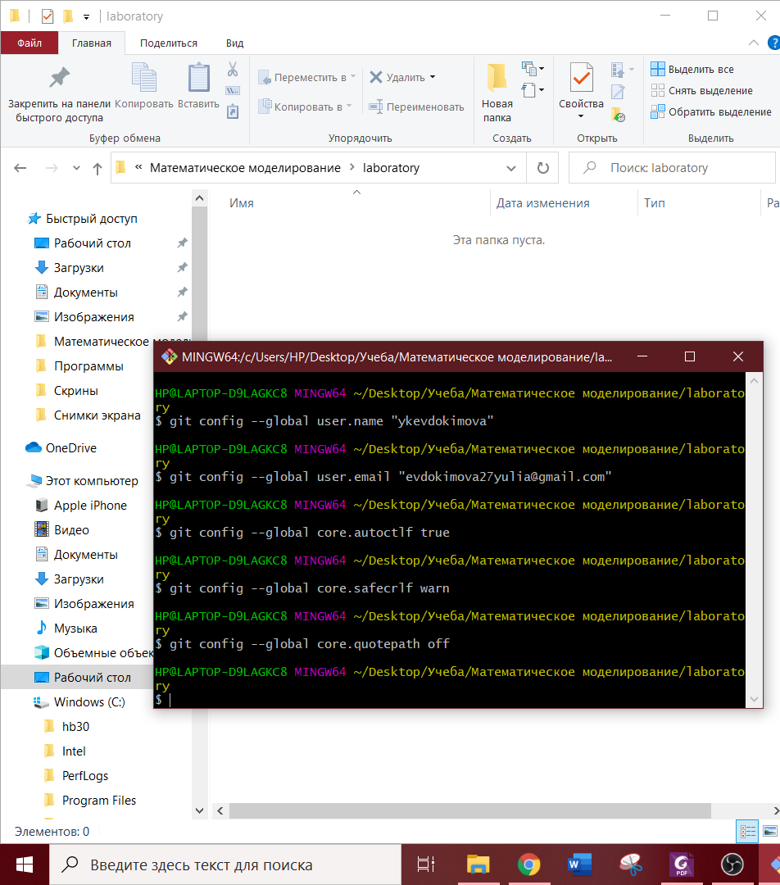{ #fig:001 width=70% }  
  

4. Создание первого файла, репозитория, дальнейшая работа с ними

Создаю папку для первой лабораторной, помещаю в нее пустой файл и открываю его на редактирование (рис. -@fig:002). После этого создаю git репозиторий из каталога laboratory, основного каталога с работами по Математическому моделированию (рис. -@fig:003).  

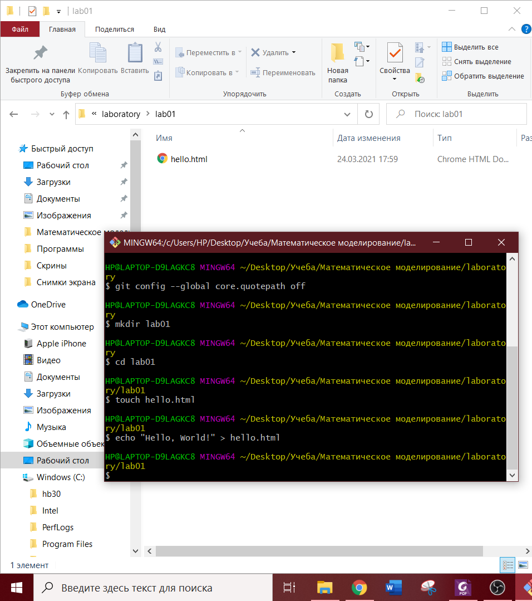{ #fig:002 width=70% }

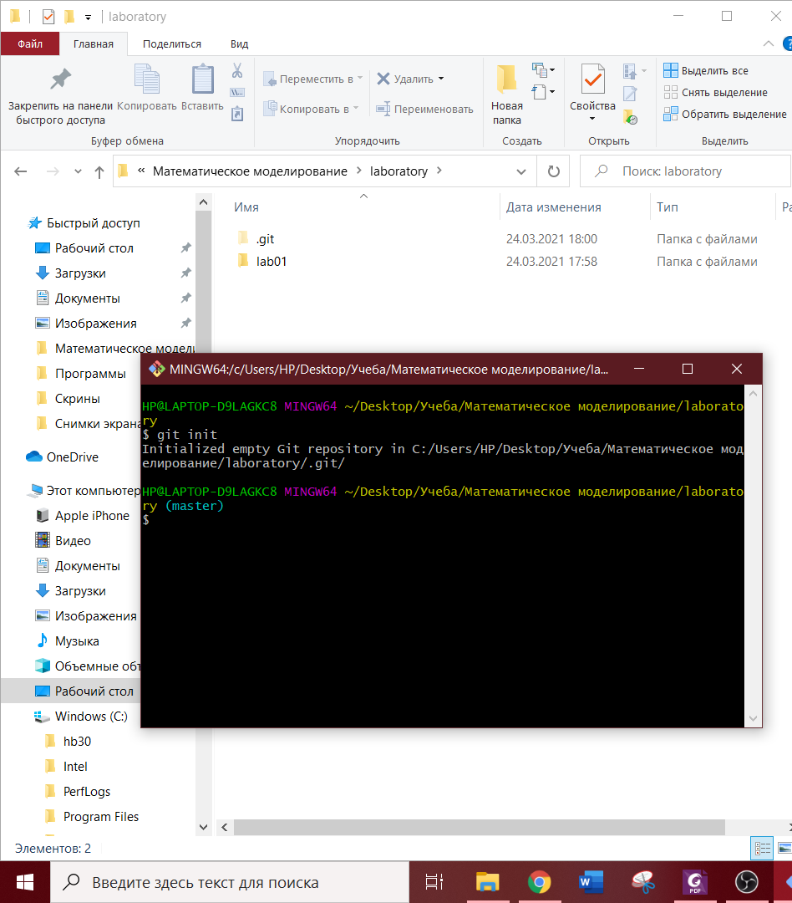{ #fig:003 width=70% }  
  

5. Основная работа с репозиторием 
 
Добавим файл в репозиторий и проверим его состояние.  (рис. -@fig:004).  
  
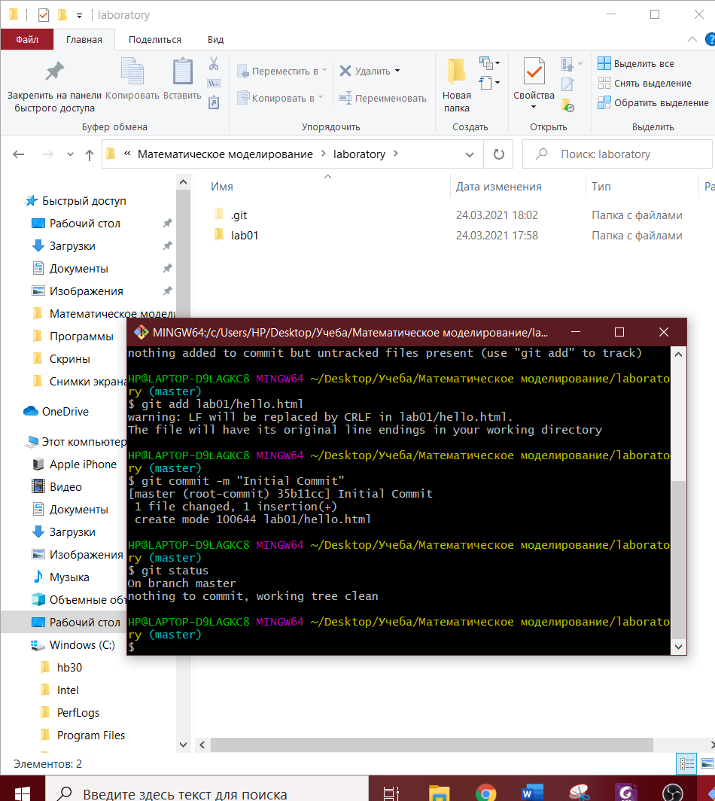{ #fig:004 width=70% }  

Изменим созданную ранее страницу (рис. -@fig:005).  

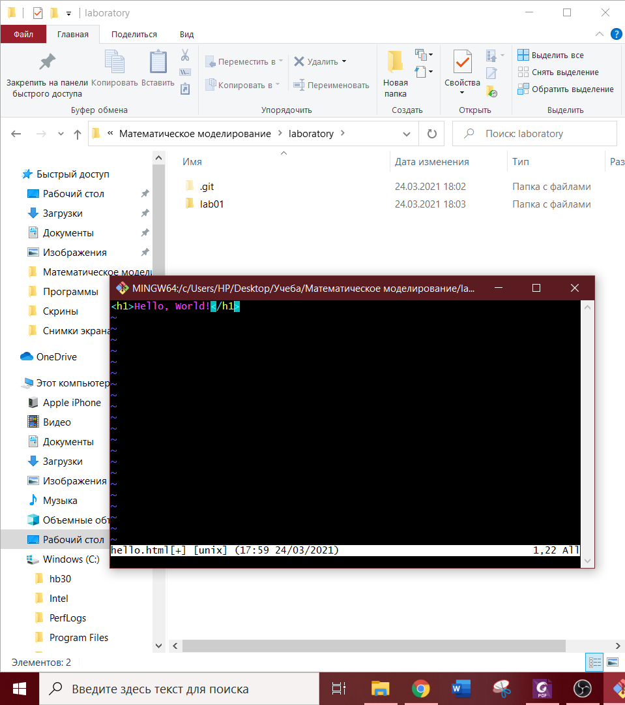{ #fig:005 width=70% }  
  
После проверки состояния рабочего каталога командой git status видим, что файл hello.html был изменен, но при этом эти изменения еще не зафиксированы в репозитории. Также обратим внимание на то, что сообщение о состоянии дает подсказку о том, что нужно делать дальше (рис. -@fig:006).

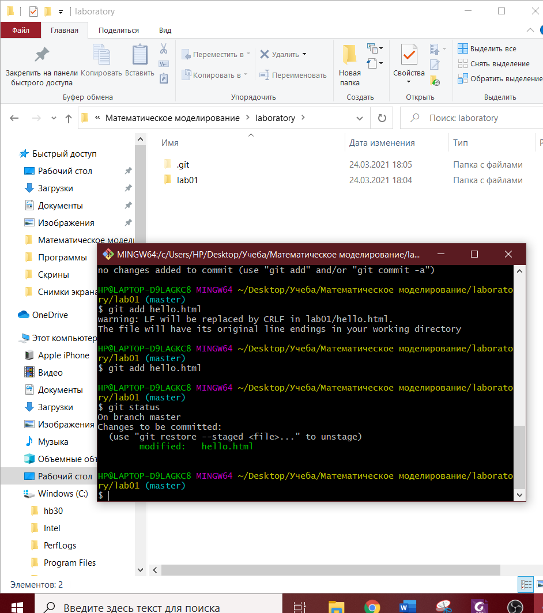{ #fig:006 width=70% }  

Внесем очередные изменения в наш файл (рис. -@fig:007). 

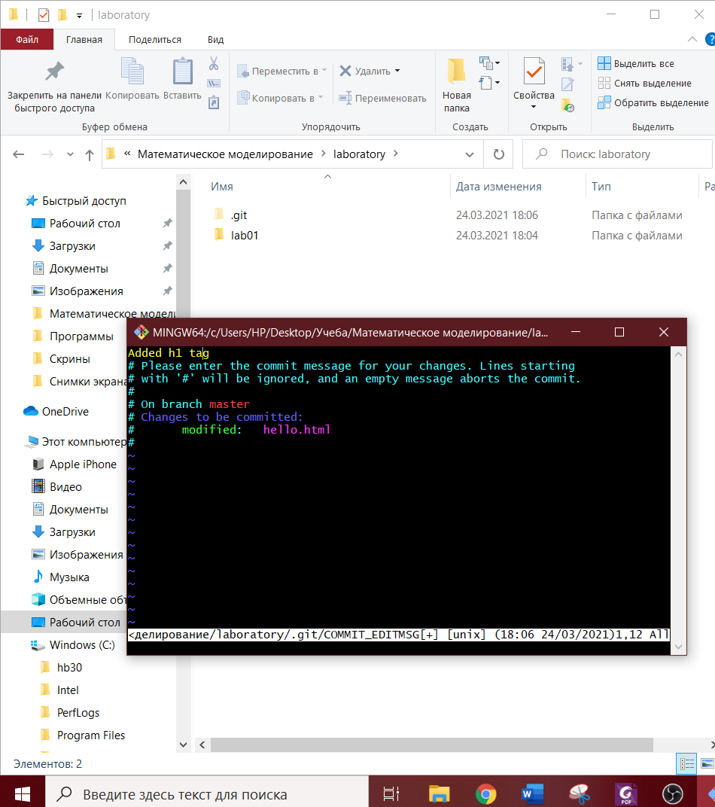{ #fig:007 width=70% }  

Теперь выполним команду git add, чтобы проиндексировать изменения. Проверим состояние (рис. -@fig:008). Изменения файла hello.html были проиндексированы. Это означает, что git теперь знает об изменении, но изменение пока не записано в репозиторий. Следующий коммит будет включать в себя проиндексированные изменения.
  
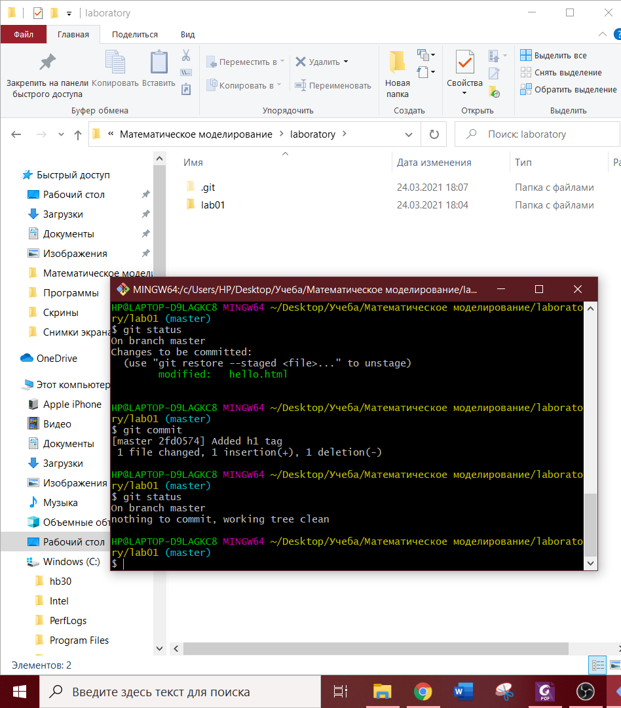{ #fig:008 width=70% }    

Просматриваю список произведенных изменений в разных форматах(рис. -@fig:009).  
  
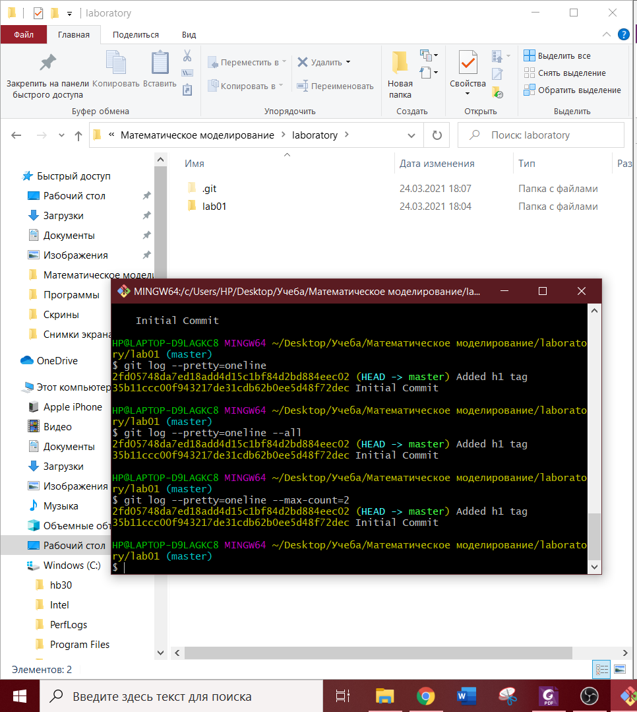{ #fig:009 width=70% }  

6. Подключение удаленного репозитория на GitHub.  

Связываю репозиторий с репозиторием на GitHub (рис. -@fig:010).  
В главном каталоге создаю файл README.md и добавляю его в репозиторий, обнавляю данные в удаленном репозитории (рис. -@fig:011).  

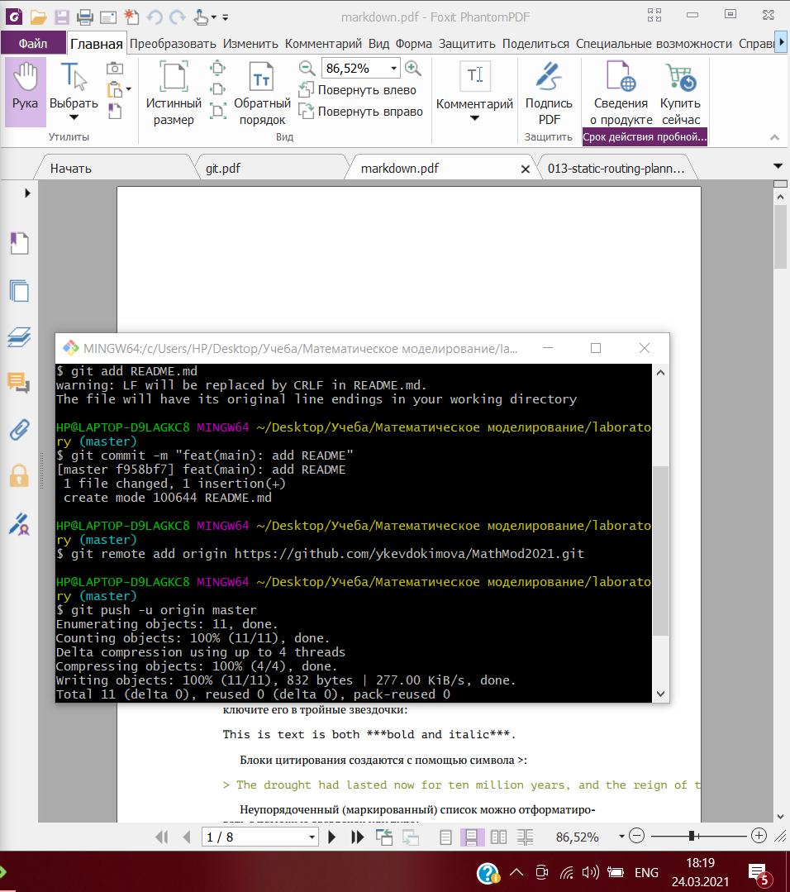{ #fig:010 width=70% }  

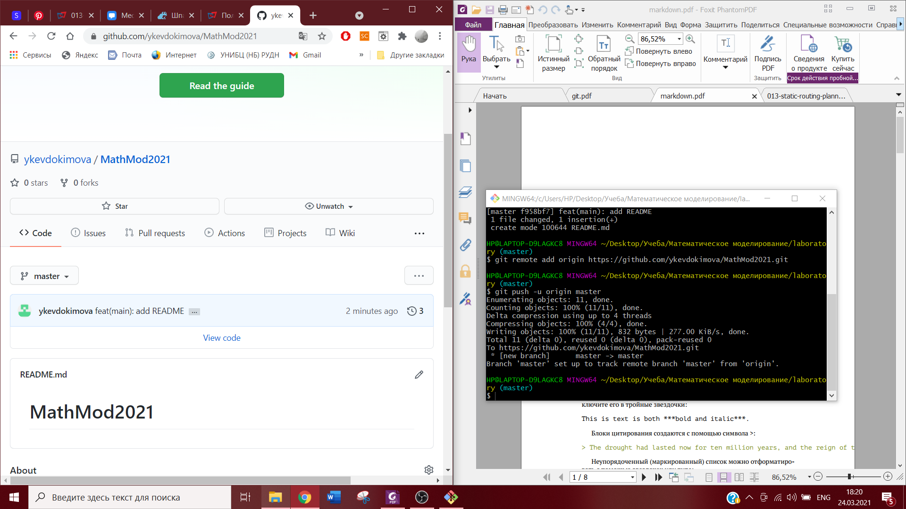{ #fig:011 width=70% }  
  
7. Демонстрирую итог проделанной работы.  
  
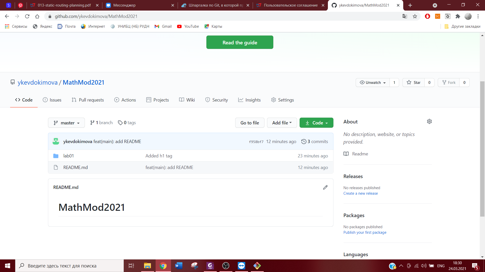{ #fig:012 width=70% }  
 
  
## Знакомство с Markdown
### Теоритические сведения  
Markdown — облегчённый язык разметки, созданный с целью обозначения форматирования в простом тексте, с максимальным сохранением его читаемости человеком, и пригодный для машинного преобразования в языки для продвинутых публикаций.  
  

# Вывод

Изучены основные возможности git и markdown.  
