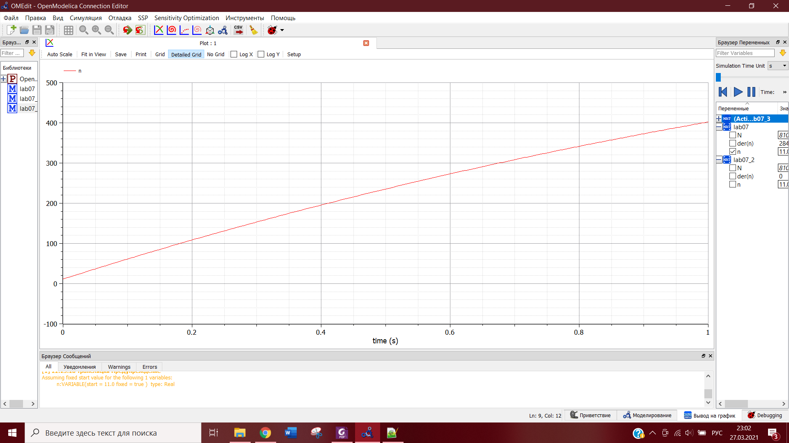
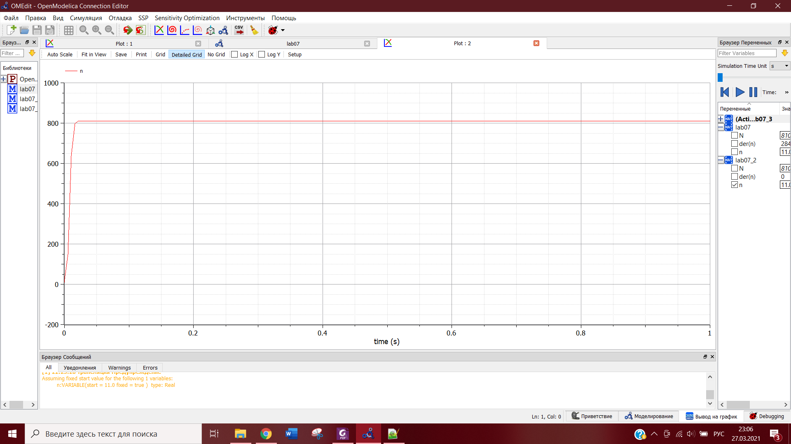
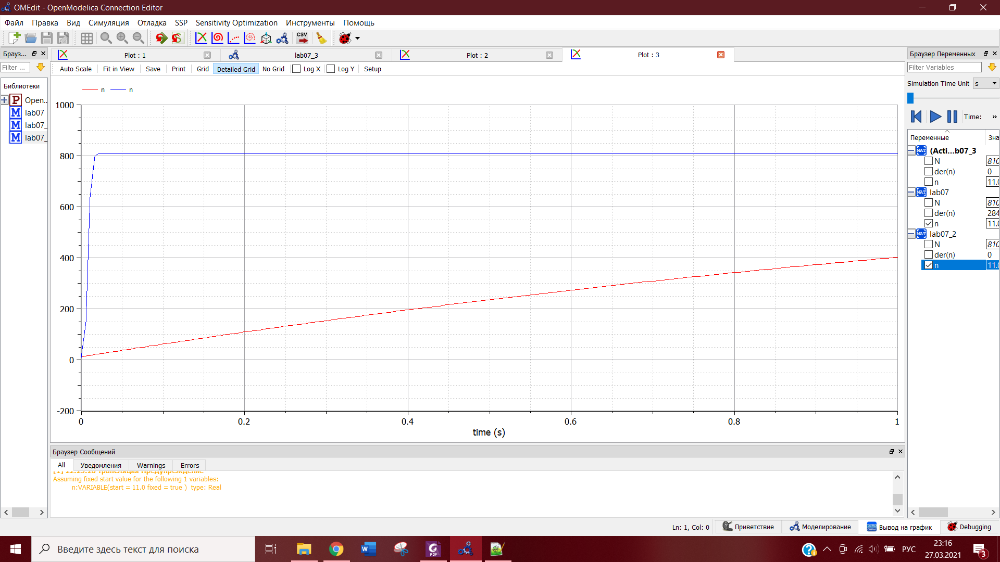
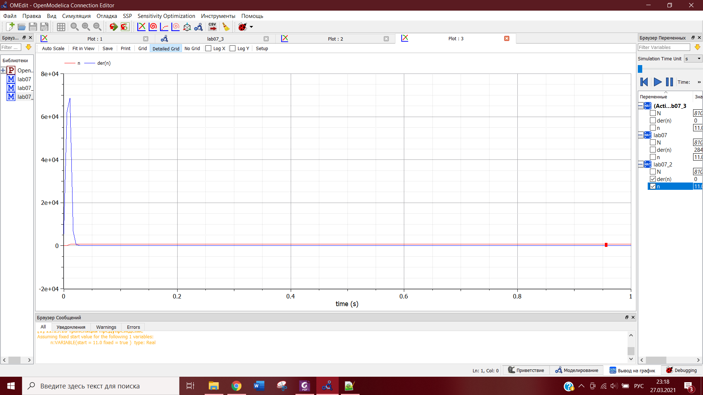
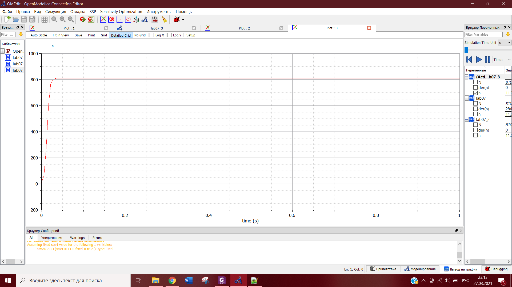

---
## Front matter
lang: ru-RU
title: Лабораторная работа №7
author: |
	Yulia Evdokimova\inst{1}
institute: |
	\inst{1}RUDN University, Moscow, Russian Federation
date: NEC--2021, 13 February, 2021 Moscow, Russia

## Formatting
toc: false
slide_level: 2
theme: metropolis
header-includes: 
 - \metroset{progressbar=frametitle,sectionpage=progressbar,numbering=fraction}
 - '\makeatletter'
 - '\beamer@ignorenonframefalse'
 - '\makeatother'
aspectratio: 43
section-titles: true
---

# Цели и задачи 

## Цель работы

Цель работы --- построение модели распространения рекламы для разных уравнений.

## Задание

**Вариант 8**

Постройте график распространения рекламы, математическая модель которой описывается следующим уравнением:  
1. $\frac{dn}{dt}=(0.64+0.00014n(t))(N-n(t))$.  
2. $\frac{dn}{dt}=(0.000014+0.63n(t))(N-n(t))$.  
3. $\frac{dn}{dt}=(0.7t+0.4cos(t)n(t))(N-n(t))$.  

При этом объем аудитории N=810, в начальный момент о товаре знает 11 человек. Для случая 2 определите, в какой момент времени скорость распространения рекламы будет иметь максимальное значение. 

# Моделирование распространения рекламы

## Случай 1: $a_1(t)>a_2(t)$

$$\frac{dn}{dt}=(0.64+0.00014n(t))(N-n(t))$$

Построим график распространения рекламы для этого случая (рис. -@fig:001):  

{ #fig:001 width=70% }   

## Случай 2: $a_1(t)<a_2(t)$ 

$$\frac{dn}{dt}=(0.000014+0.63n(t))(N-n(t))$$

Построим график распространения рекламы для этого случая (рис. -@fig:002):  

{ #fig:002 width=70% }  

## Сравнение $a_1(t)>a_2(t)$ и $a_1(t)<a_2(t)$

Сравним эффективность рекламной кампании при $a_1(t)>a_2(t)$ и $a_1(t)<a_2(t)$ (рис. -@fig:003):  

{ #fig:003 width=70% }  

## Определение времени с максимально быстрым ростом эффективности

Определить? в какой момент времени эффективность рекламы будет иметь
максимально быстрый рост для случая 2.  
Маскимальное значение в момент времени **$t$=0.01** (рис. -@fig:004):  

{ #fig:004 width=70% }  

## Случай 3:

$$\frac{dn}{dt}=(0.7t+0.4cos(t)n(t))(N-n(t))$$

Построим график распространения рекламы для этого случая (рис. -@fig:005): 

{ #fig:005 width=70% }  

# Вывод

В ходе выполнения данной лабораторной работы я изучила модель рекламной кампании и построила графики распространения рекламы, математические модели которых описываются различными уравнениями. Также для одного из случаев я определила момент времени, в котором скорость распространения рекламы имеет максимальное значение.
