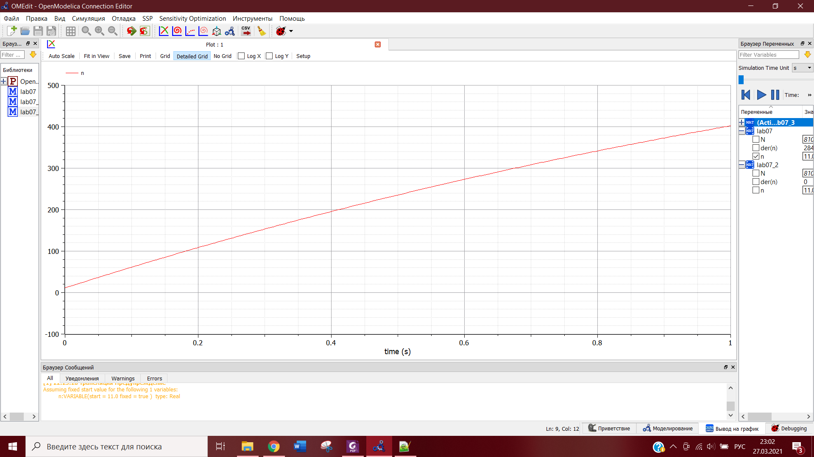
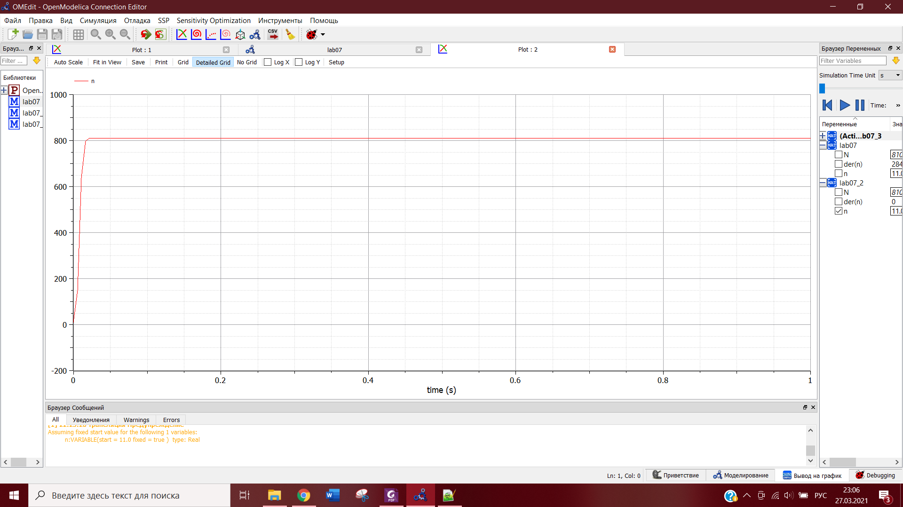
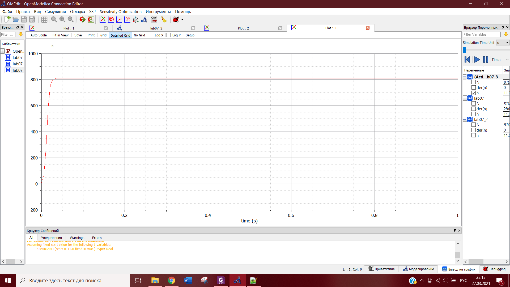
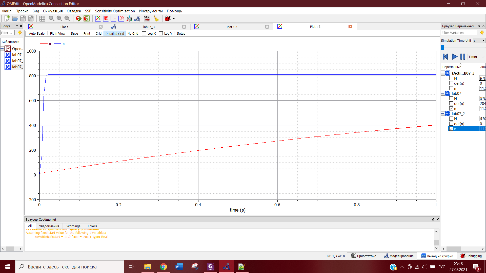
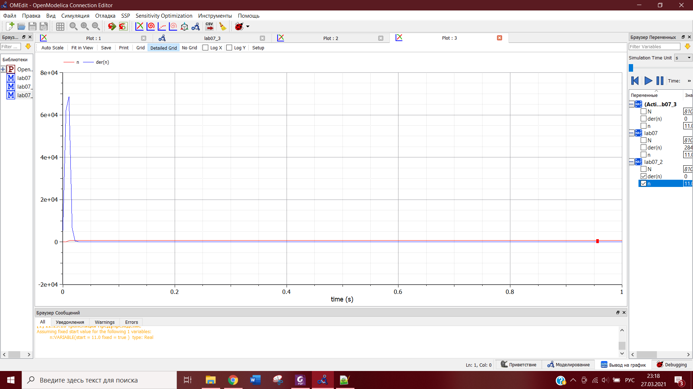

---
# Front matter
lang: ru-RU
title: "Лабораторная работа №7"
subtitle: "Эффективность рекламы"
author: "Евдокимова Юлия, НПИбд-01-18"

# Formatting
toc-title: "Содержание"
toc: true # Table of contents
toc_depth: 2
lof: true # List of figures
lot: true # List of tables
fontsize: 12pt
linestretch: 1.5
papersize: a4paper
documentclass: scrreprt
polyglossia-lang: russian
polyglossia-otherlangs: english
mainfont: PT Serif
romanfont: PT Serif
sansfont: PT Sans
monofont: PT Mono
mainfontoptions: Ligatures=TeX
romanfontoptions: Ligatures=TeX
sansfontoptions: Ligatures=TeX,Scale=MatchLowercase
monofontoptions: Scale=MatchLowercase
indent: true
pdf-engine: lualatex
header-includes:
  - \linepenalty=10 # the penalty added to the badness of each line within a paragraph (no associated penalty node) Increasing the value makes tex try to have fewer lines in the paragraph.
  - \interlinepenalty=0 # value of the penalty (node) added after each line of a paragraph.
  - \hyphenpenalty=50 # the penalty for line breaking at an automatically inserted hyphen
  - \exhyphenpenalty=50 # the penalty for line breaking at an explicit hyphen
  - \binoppenalty=700 # the penalty for breaking a line at a binary operator
  - \relpenalty=500 # the penalty for breaking a line at a relation
  - \clubpenalty=150 # extra penalty for breaking after first line of a paragraph
  - \widowpenalty=150 # extra penalty for breaking before last line of a paragraph
  - \displaywidowpenalty=50 # extra penalty for breaking before last line before a display math
  - \brokenpenalty=100 # extra penalty for page breaking after a hyphenated line
  - \predisplaypenalty=10000 # penalty for breaking before a display
  - \postdisplaypenalty=0 # penalty for breaking after a display
  - \floatingpenalty = 20000 # penalty for splitting an insertion (can only be split footnote in standard LaTeX)
  - \raggedbottom # or \flushbottom
  - \usepackage{float} # keep figures where there are in the text
  - \floatplacement{figure}{H} # keep figures where there are in the text
---

# Цель работы

Цель работы --- построение модели распространения рекламы для разных уравнений.

# Задание

**Вариант 8**  

Постройте график распространения рекламы, математическая модель которой описывается следующим уравнением:  
1. $\frac{dn}{dt}=(0.64+0.00014n(t))(N-n(t))$.  
2. $\frac{dn}{dt}=(0.000014+0.63n(t))(N-n(t))$.  
3. $\frac{dn}{dt}=(0.7t+0.4cos(t)n(t))(N-n(t))$.  

При этом объем аудитории N=810, в начальный момент о товаре знает 11 человек. Для случая 2 определите, в какой момент времени скорость распространения рекламы будет иметь максимальное значение.  

# Выполнение лабораторной работы

## Теоретические сведения

Организуется рекламная кампания нового товара или услуги. Необходимо,
чтобы прибыль будущих продаж с избытком покрывала издержки на рекламу.
Вначале расходы могут превышать прибыль, поскольку лишь малая часть
потенциальных покупателей будет информирована о новинке. Затем, при
увеличении числа продаж, возрастает и прибыль, и, наконец, наступит момент,
когда рынок насытиться, и рекламировать товар станет бесполезным.  

Предположим, что торговыми учреждениями реализуется некоторая
продукция, о которой в момент времени $t$ из числа потенциальных покупателей $N$ знает лишь $n$ покупателей. Для ускорения сбыта продукции запускается реклама по радио, телевидению и других средств массовой информации. После запуска
рекламной кампании информация о продукции начнет распространяться среди
потенциальных покупателей путем общения друг с другом. Таким образом, после
запуска рекламных объявлений скорость изменения числа знающих о продукции
людей пропорциональна как числу знающих о товаре покупателей, так и числу
покупателей о нем не знающих.  

Модель рекламной кампании описывается следующими величинами.
Считаем, что
$\frac{dn}{dt}$
 - скорость изменения со временем числа потребителей,
узнавших о товаре и готовых его купить,
$t$ - время, прошедшее с начала рекламной
кампании,
$n(t)$ - число уже информированных клиентов. Эта величина
пропорциональна числу покупателей, еще не знающих о нем, это описывается
следующим образом:
$a_1(t)(N-n(t))$ , где
$N$ - общее число потенциальных
платежеспособных покупателей,
$a_1(t)>0$ - характеризует интенсивность
рекламной кампании (зависит от затрат на рекламу в данный момент времени).
Помимо этого, узнавшие о товаре потребители также распространяют полученную
информацию среди потенциальных покупателей, не знающих о нем (в этом случае
работает т.н. сарафанное радио). Этот вклад в рекламу описывается величиной
$a_2(t)n(t)(N-n(t))$ , эта величина увеличивается с увеличением потребителей
узнавших о товаре. Математическая модель распространения рекламы описывается
уравнением:
 $$\frac{dn}{dt}=(a_1(t)+a_2(t)n(t))(N-n(t))$$
  
При $a_1(t)>>a_2(t)$ получается модель типа модели Мальтуса. В обратном случае, при $a_1(t)<<a_2(t)$ получаем уравнение логистической кривой.

## Ход работы  

### Построение графиков распространенения рекламы 

1. $a_1(t)>a_2(t)$  
В этом случае коэффициент платной рекламы значительно выше, чем коэффициент сарафанного радио:  
$$\frac{dn}{dt}=(0.64+0.00014n(t))(N-n(t))$$

Построим график распространения рекламы для этого случая (рис. -@fig:001):  

{ #fig:001 width=70% }  

Получаем модель Мальтуса.

Код программы в Modelica:  

model lab07

parameter Real N = 810; 
Real n (start = 11);

equation
der(n) = (0.64+0.00014*n)*(N-n);

end lab07; 

2. $a_1(t)<a_2(t)$  
Здесь коэффициент платной рекламы ниже, чем коэффициент сарафанного радио: 
$$\frac{dn}{dt}=(0.000014+0.63n(t))(N-n(t))$$

Построим график распространения рекламы для этого случая (рис. -@fig:002):  

{ #fig:002 width=70% }  

Получаем уравнение логистической кривой.

Код программы в Modelica:  

model lab07_2

parameter Real N = 810; 
Real n (start = 11);

equation
der(n) = (0.000014+0.63*n)*(N-n);

end lab07_2;

3. Построим график распространения рекламы для третьего случая. Здесь математическая модель описывается следующим уравнением:  

$$\frac{dn}{dt}=(0.7t+0.4cos(t)n(t))(N-n(t))$$

Посмотрим на график (рис. -@fig:003): 

{ #fig:003 width=70% }  

Получаем уравнение логистической кривой.

Код программы в Modelica:  

model lab07_3

parameter Real N = 810; 
Real n (start = 11);

equation
der(n) = (0.7*time+0.4*cos(time)*n)*(N-n);

end lab07_3;

### Сравнение эффективности двух первых математических моделей

Сравним эффективность рекламной кампании при $a_1(t)>a_2(t)$ и $a_1(t)<a_2(t)$ (рис. -@fig:004):  

{ #fig:004 width=70% }  

По графику видно, что эффективность рекламной кампании во втором случае значительно выше.

### Определение времени с максимально быстрым ростом эффективности

Необходимо определить, в какой момент времени эффективность рекламы будет иметь максимально быстрый рост для случая 2.

Для этого построим график производной n и увидим, когда он принимает максимальное значение (рис. -@fig:005):  

{ #fig:005 width=70% }  

Маскимальное значение в момент времени $t$=0.01.

## Вопросы к лабораторной работе

1. Записать модель Мальтуса (дать пояснение, где используется данная модель).  
  
Согласно модели, предложенной Мальтусом, скорость роста пропорциональна текущему размеру популяции, то есть описывается дифференциальным уравнением:  
$$ẋ=ax$$
  
Иначе модель называют простой экспоненциальной, экспоненциальным законом  или мальтузианским законом (англ. Malthusian law). Он широко используется в популяционной экологии как первый принцип популяционной динамики. Мальтус писал, что для всех форм жизни, располагающих избытком ресурсов, характерен экспоненциальный рост популяции. Тем не менее, в какой-то момент ресурсов начинает недоставать, и рост замедляется.  
  
Модель Мальтуса:  
$$\frac{dn}{dt}=(a_1(t)+a_2(t)n(t))(N-n(t))$$
В случае $a_1(t)>>a_2(t)$.

2. Записать уравнение логистической кривой (дать пояснение, что описывает
данное уравнение).  
  
Поведение популяции, численность которой стабилизируется на некотором устойчивом уровне, часто описывают с помощью логистического уравнения, предложенного Ферхюльстом в 1838 г.
$$ẋ=εx-δx^2$$
  
Модель $\frac{dn}{dt}=(a_1(t)+a_2(t)n(t))(N-n(t))$ в случае $a_1(t)<<a_2(t)$ является логистической кривой.
  
3. На что влияет коэффициент $a_1(t)$ и $a_2(t)$ в модели распространенияn рекламы.  
  
Коэффициент $a_1(t)$ показывает вклад платной рекламы, а $a_2(t)$ - сарафанного радио.  
  
4. Как ведет себя рассматриваемая модель при $a_1(t)>>a_2(t)$.  
  
Количество информированной аудитории возрастает экспоненциально.
  
5. Как ведет себя рассматриваемая модель при $a_1(t)<<a_2(t)$.  
  
Количество информированной аудитории изменяется по принципу логистической кривой.

# Выводы

В ходе выполнения данной лабораторной работы я изучила модель рекламной кампании и построила графики распространения рекламы, математические модели которых описываются различными уравнениями. Также для одного из случаев я определила момент времени, в котором скорость распространения рекламы имеет максимальное значение.
