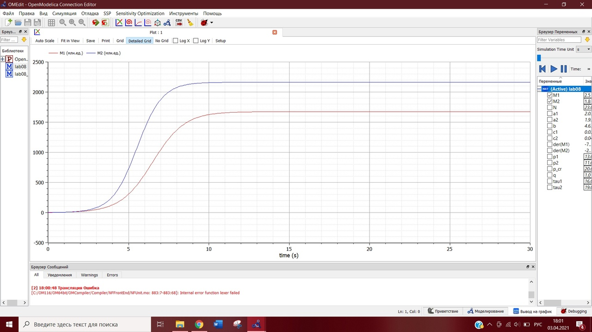
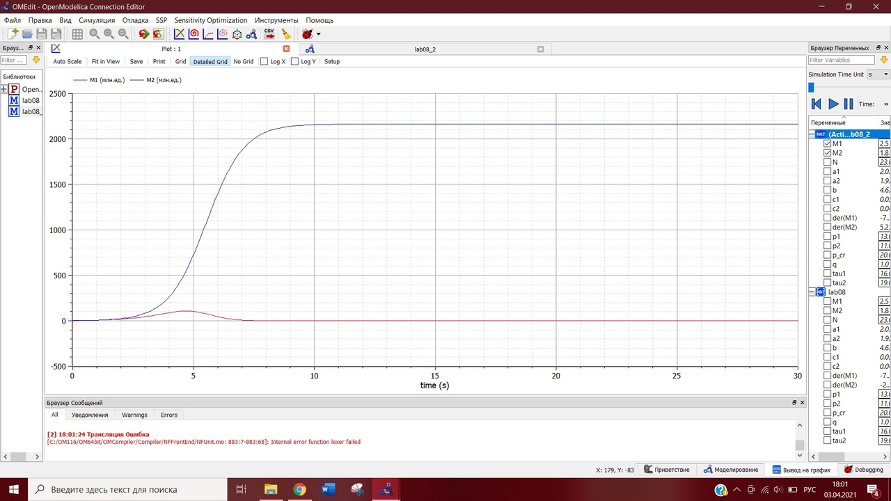

---
## Front matter
lang: ru-RU
title: Лабораторная работа №8
author: |
	Евдокимова Юлия\inst{1}
institute: |
	\inst{1}RUDN University, Moscow, Russian Federation
date: NEC--2021, 3 April, 2021 Moscow, Russia

## Formatting
toc: false
slide_level: 2
theme: metropolis
header-includes: 
 - \metroset{progressbar=frametitle,sectionpage=progressbar,numbering=fraction}
 - '\makeatletter'
 - '\beamer@ignorenonframefalse'
 - '\makeatother'
aspectratio: 43
section-titles: true
---

# Цели и задачи 

## Цель работы

Цель работы --- построение модели конкуренции двух фирм.

## Задание

**Вариант 8**

1. Постройте графики изменения оборотных средств фирмы 1 и фирмы 2 без учета постоянных издержек и с веденной нормировкой для случая 1.
2. Постройте графики изменения оборотных средств фирмы 1 и фирмы 2 без учета постоянных издержек и с веденной нормировкой для случая 2.

# Моделирование конкуренции фирм

## Случай 1

$$\frac{dM_1}{d\theta}=M_1-\frac{b}{c_1}M_1M_2-\frac{a_1}{c_1}M_1^2 ,$$
$$\frac{dM_2}{d\theta}=\frac{c_2}{c_1}M_2-\frac{b}{c_1}M_1M_2-\frac{a_2}{c_1}M_2^2$$
где $a_1=\frac{p_{cr}}{\tau_1^2\widetilde{p}_1^2Nq}$, $a_2=\frac{p_{cr}}{\tau_2^2\widetilde{p}_2^2Nq}$, $b=\frac{p_{cr}}{\tau_1^2\widetilde{p}_1^2\tau_2^2\widetilde{p}_2^2Nq}$, $c_1=\frac{p_{cr}-\widetilde{p}_1}{\tau_1\widetilde{p}_1}$, $c_2=\frac{p_{cr}-\widetilde{p}_2}{\tau_2\widetilde{p}_2}$.  
Также введена нормировка $t=c_1\theta$.  
Начальные условия и параметры:
${M_1}_0=4.5, {M_2}_0=6.5, p_cr=24, N=54, q=1, \tau_1=24, \tau_2=20, \widetilde{p}_1=7.4, \widetilde{p}_2=11.4$.

## Случай 1: Построение графиков изменения оборотных средств фирм при влиянии только экономического фактора

Построение графика изменения оборотных средств фирм для этого случая (рис. -@fig:001):  

{ #fig:001 width=70% }   

## Случай 2

$$\frac{dM_1}{d\theta}=M_1-(\frac{b}{c_1}+0.0017)M_1M_2-\frac{a_1}{c_1}M_1^2 ,$$
$$\frac{dM_2}{d\theta}=\frac{c_2}{c_1}M_2-\frac{b}{c_1}M_1M_2-\frac{a_2}{c_1}M_2^2$$

где $a_1=\frac{p_{cr}}{\tau_1^2\widetilde{p}_1^2Nq}$, $a_2=\frac{p_{cr}}{\tau_2^2\widetilde{p}_2^2Nq}$, $b=\frac{p_{cr}}{\tau_1^2\widetilde{p}_1^2\tau_2^2\widetilde{p}_2^2Nq}$, $c_1=\frac{p_{cr}-\widetilde{p}_1}{\tau_1\widetilde{p}_1}$, $c_2=\frac{p_{cr}-\widetilde{p}_2}{\tau_2\widetilde{p}_2}$.  
Также введена нормировка $t=c_1\theta$.  
Начальные условия и параметры:
${M_1}_0=4.5, {M_2}_0=6.5, p_cr=24, N=54, q=1, \tau_1=24, \tau_2=20, \widetilde{p}_1=7.4, \widetilde{p}_2=11.4$.

## Случай 2: Построение графиков изменения оборотных средств фирм при влиянии помимо экономического фактора еще и еще и социально-психологических факторов 

Построение графика изменения оборотных средств фирм для этого случая (рис. -@fig:002):  

{ #fig:002 width=70% }  

# Вывод

В ходе выполнения лабораторной работы я изучила модель конкуренции двух фирм, построила графики изменения оборотных средств фирм для двух случаев. 

## {.standout}

Спасибо за внимание!
