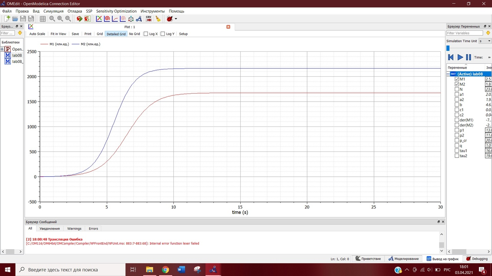
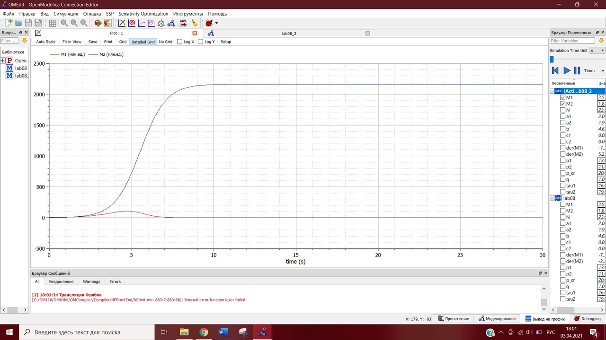

---
# Front matter
lang: ru-RU
title: "Лабораторная работа №8"
subtitle: "Модель конкуренции двух фирм"
author: "Евдокимова Юлия, НПИбд-01-18"

# Formatting
toc-title: "Содержание"
toc: true # Table of contents
toc_depth: 2
lof: true # List of figures
lot: true # List of tables
fontsize: 12pt
linestretch: 1.5
papersize: a4paper
documentclass: scrreprt
polyglossia-lang: russian
polyglossia-otherlangs: english
mainfont: PT Serif
romanfont: PT Serif
sansfont: PT Sans
monofont: PT Mono
mainfontoptions: Ligatures=TeX
romanfontoptions: Ligatures=TeX
sansfontoptions: Ligatures=TeX,Scale=MatchLowercase
monofontoptions: Scale=MatchLowercase
indent: true
pdf-engine: lualatex
header-includes:
  - \linepenalty=10 # the penalty added to the badness of each line within a paragraph (no associated penalty node) Increasing the value makes tex try to have fewer lines in the paragraph.
  - \interlinepenalty=0 # value of the penalty (node) added after each line of a paragraph.
  - \hyphenpenalty=50 # the penalty for line breaking at an automatically inserted hyphen
  - \exhyphenpenalty=50 # the penalty for line breaking at an explicit hyphen
  - \binoppenalty=700 # the penalty for breaking a line at a binary operator
  - \relpenalty=500 # the penalty for breaking a line at a relation
  - \clubpenalty=150 # extra penalty for breaking after first line of a paragraph
  - \widowpenalty=150 # extra penalty for breaking before last line of a paragraph
  - \displaywidowpenalty=50 # extra penalty for breaking before last line before a display math
  - \brokenpenalty=100 # extra penalty for page breaking after a hyphenated line
  - \predisplaypenalty=10000 # penalty for breaking before a display
  - \postdisplaypenalty=0 # penalty for breaking after a display
  - \floatingpenalty = 20000 # penalty for splitting an insertion (can only be split footnote in standard LaTeX)
  - \raggedbottom # or \flushbottom
  - \usepackage{float} # keep figures where there are in the text
  - \floatplacement{figure}{H} # keep figures where there are in the text
---

# Цель работы

Цель работы --- построение модели конкуренции двух фирм.

# Задание

**Вариант 8**  

**Случай 1.** Рассмотрим две фирмы, производящие взаимозаменяемые товары
одинакового качества и находящиеся в одной рыночной нише. В рамках
этой модели конкурентная борьба ведётся только рыночными методами. То есть,
конкуренты не могут прямо вмешиваться в 
ситуацию на рынке и каким-либо способом влиять на потребителей. Будем считать, что постоянные издержки пренебрежимо малы, и в
модели учитывать не будем. В этом случае динамика изменения объемов продаж
фирмы 1 и фирмы 2 описывается следующей системой уравнений:
$$\frac{dM_1}{d\theta}=M_1-\frac{b}{c_1}M_1M_2-\frac{a_1}{c_1}M_1^2 ,$$
$$\frac{dM_2}{d\theta}=\frac{c_2}{c_1}M_2-\frac{b}{c_1}M_1M_2-\frac{a_2}{c_1}M_2^2$$
где $a_1=\frac{p_{cr}}{\tau_1^2\widetilde{p}_1^2Nq}$, $a_2=\frac{p_{cr}}{\tau_2^2\widetilde{p}_2^2Nq}$, $b=\frac{p_{cr}}{\tau_1^2\widetilde{p}_1^2\tau_2^2\widetilde{p}_2^2Nq}$, $c_1=\frac{p_{cr}-\widetilde{p}_1}{\tau_1\widetilde{p}_1}$, $c_2=\frac{p_{cr}-\widetilde{p}_2}{\tau_2\widetilde{p}_2}$.  
Также введена нормировка $t=c_1\theta$.

**Случай 2.** Рассмотрим модель, когда, помимо экономического фактора
влияния, используются еще и социально-психологические факторы –
формирование общественного предпочтения одного товара другому, не зависимо от их качества и цены. В этом случае взаимодействие двух фирм будет зависеть друг от друга, соответственно коэффициент перед $M_1M_2$ будет отличаться. Пусть в рамках рассматриваемой модели динамика изменения объемов продаж фирмы 1 и фирмы 2 описывается следующей системой уравнений:
$$\frac{dM_1}{d\theta}=M_1-(\frac{b}{c_1}+0.0017)M_1M_2-\frac{a_1}{c_1}M_1^2 ,$$
$$\frac{dM_2}{d\theta}=\frac{c_2}{c_1}M_2-\frac{b}{c_1}M_1M_2-\frac{a_2}{c_1}M_2^2$$
где $a_1=\frac{p_{cr}}{\tau_1^2\widetilde{p}_1^2Nq}$, $a_2=\frac{p_{cr}}{\tau_2^2\widetilde{p}_2^2Nq}$, $b=\frac{p_{cr}}{\tau_1^2\widetilde{p}_1^2\tau_2^2\widetilde{p}_2^2Nq}$, $c_1=\frac{p_{cr}-\widetilde{p}_1}{\tau_1\widetilde{p}_1}$, $c_2=\frac{p_{cr}-\widetilde{p}_2}{\tau_2\widetilde{p}_2}$.  

Также введена нормировка $t=c_1\theta$.

Для обоих случаев рассмотрим задачу со следующими начальными условиями и параметрами:
${M_1}_0=2.5, {M_2}_0=1.8, p_cr=20, N=23, q=1, \tau_1=16, \tau_2=19, \widetilde{p}_1=13, \widetilde{p}_2=11$.  

**Замечание:** Значения $p_{cr}, \widetilde{p}_{1,2}, N$ указаны в тысячах единиц, а значения $M_{1,2}$ указаны в млн. единиц.  

**Обозначения:**  
$N$ - число потребителей производимого продукта.  
$\tau$ - длительность производственного цикла.  
$p$ - рыночная цена товара.  
$\widetilde{p}$ - себестоимость продукта, то есть переменные издержки на производство единицы
продукции.  
$q$ - максимальная потребность одного человека в продукте в единицу времени.  
$\theta=\frac{t}{c_1}$ - безразмерное время.  

1. Постройте графики изменения оборотных средств фирмы 1 и фирмы 2 без учета постоянных издержек и с веденной нормировкой для случая 1.
2. Постройте графики изменения оборотных средств фирмы 1 и фирмы 2 без учета постоянных издержек и с веденной нормировкой для случая 2.

# Выполнение лабораторной работы

## Теоретические сведения

### Модель одной фирмы
  
Для построения модели конкуренции хотя бы двух фирм необходимо
рассмотреть модель одной фирмы. Вначале рассмотрим модель фирмы,
производящей продукт долговременного пользования, когда цена его определяется балансом спроса и предложения. Примем, что этот продукт занимает определенную нишу рынка и конкуренты в ней отсутствуют.

Обозначим:  
$N$ - число потребителей производимого продукта.  
$S$ - доходы потребителей данного продукта. Считаем, что доходы всех
потребителей одинаковы. Это предположение справедливо, если речь идет об
одной рыночной нише, т.е. производимый продукт ориентирован на определенный
слой населения.  
$M$ - оборотные средства предприятия.  
$\tau$ - длительность производственного цикла.  
$p$ - рыночная цена товара
$\widetilde{p}$ - себестоимость продукта, то есть переменные издержки на производство
единицы продукции.  
$\delta$ - доля оборотных средств, идущая на покрытие переменных издержек.  
$\kappa$ - постоянные издержки, которые не зависят от количества выпускаемой
продукции.  
$q$ - максимальная потребность одного человека в продукте в единицу времени

$Q(S/p)$ - функция спроса, зависящая от отношения дохода S к цене p. Она
равна количеству продукта, потребляемого одним потребителем в единицу
времени.  

Уравнения динамики оборотных средств можно записать в виде
$$\frac{dM}{dt}=-\frac{M\delta}{\tau}+NQp-\kappa=-\frac{M\delta}{\tau}-Nq(1-\frac{p}{p_{cr}})p-\kappa$$

Равновесное значение цены $p$ равно
$$p=p_{cr}(1-\frac{M\delta}{\tau\widetilde{p}Nq})$$

Тогда уравнение динамики оборотных средств приобретает вид
$$\frac{dM}{dt}=M\frac{\delta}{\tau}(\frac{p_{cr}}{\widetilde{p}}-1)-M^2(\frac{\delta}{\tau\widetilde{p}})^2\frac{p_{cr}}{Nq}-\kappa$$

В обсуждаемой модели параметр $\delta$ всюду входит в сочетании с $\tau$. Это значит,
что уменьшение доли оборотных средств, вкладываемых в производство,
эквивалентно удлинению производственного цикла. Поэтому мы в дальнейшем
положим: $\delta=1$, а параметр $\tau$ будем считать временем цикла, с учётом сказанного.

### Конкуренция двух фирм

***Случай 1***  

Рассмотрим две фирмы, производящие взаимозаменяемые товары
одинакового качества и находящиеся в одной рыночной нише. Последнее означает,
что у потребителей в этой нише нет априорных предпочтений, и они приобретут
тот или иной товар, не обращая внимания на знак фирмы.
В этом случае, на рынке устанавливается единая цена, которая определяется
балансом суммарного предложения и спроса. Иными словами, в рамках нашей
модели конкурентная борьба ведётся только рыночными методами. То есть,
конкуренты могут влиять на противника путем изменения параметров своего
производства: себестоимость, время цикла, но не могут прямо вмешиваться в
ситуацию на рынке («назначать» цену или влиять на потребителей какимлибо иным способом.)
Уравнения динамики оборотных средств запишем в виде
$$\frac{dM_1}{dt}=-\frac{M_1}{\tau_1}-N_1q(1-\frac{p}{p_{cr}})p-\kappa_1$$
$$\frac{dM_2}{dt}=-\frac{M_2}{\tau_2}-N_2q(1-\frac{p}{p_{cr}})p-\kappa_2$$
где использованы те же обозначения, а индексы 1 и 2 относятся к первой и второй
фирме, соответственно. Величины $N_1$ и $N_2$ – числа потребителей, приобретших
товар первой и второй фирмы.  

Учтем, что товарный баланс устанавливается быстро, то есть,
произведенный каждой фирмой товар не накапливается, а реализуется по цене $p$. Тогда 
$$\frac{dM_1}{dt}=-\frac{M_1}{\tau_1}(1-\frac{p}{\widetilde{p}_1})-\kappa_1$$
$$\frac{dM_2}{dt}=-\frac{M_2}{\tau_2}(1-\frac{p}{\widetilde{p}_2})-\kappa_2$$

Считая, как и выше, что ценовое равновесие устанавливается быстро,
имеем
$$\frac{dM_1}{dt}=c_1M_1-bM_1M_2-a_1M_1^2-\kappa_1$$
$$\frac{dM_2}{dt}=c_2M_2-bM_1M_2-a_2M_2^2-\kappa_2$$
где
$a_1=\frac{p_{cr}}{\tau_1^2\widetilde{p}_1^2Nq}$, $a_2=\frac{p_{cr}}{\tau_2^2\widetilde{p}_2^2Nq}$, $b=\frac{p_{cr}}{\tau_1^2\widetilde{p}_1^2\tau_2^2\widetilde{p}_2^2Nq}$, $c_1=\frac{p_{cr}-\widetilde{p}_1}{\tau_1\widetilde{p}_1}$, $c_2=\frac{p_{cr}-\widetilde{p}_2}{\tau_2\widetilde{p}_2}$.  

Исследуем систему в случае, когда постоянные издержки $(\kappa_1, \kappa_2)$ пренебрежимо малы. И введем нормировку $t=c_1\theta$. Получим следующую систему
$$\frac{dM_1}{d\theta}=M_1-\frac{b}{c_1}M_1M_2-\frac{a_1}{c_1}M_1^2 ,$$
$$\frac{dM_2}{d\theta}=\frac{c_2}{c_1}M_2-\frac{b}{c_1}M_1M_2-\frac{a_2}{c_1}M_2^2$$

***Случай 2***  

Рассмотрим модель, когда, помимо экономического фактора влияния
(изменение себестоимости, производственного цикла, использование кредита и
т.п.), используются еще и социально-психологические факторы – формирование
общественного предпочтения одного товара другому, не зависимо от их качества и
цены. В этом случае взаимодействие двух фирм будет зависеть друг от друга,
соответственно коэффициент перед
$M_1M_2$
будет отличаться. 
$$\frac{dM_1}{d\theta}=M_1-(\frac{b}{c_1}+0.0017)M_1M_2-\frac{a_1}{c_1}M_1^2 ,$$
$$\frac{dM_2}{d\theta}=\frac{c_2}{c_1}M_2-\frac{b}{c_1}M_1M_2-\frac{a_2}{c_1}M_2^2$$

## Ход работы  

Заданы начальные условия  
${M_1}_0=2.5, {M_2}_0=1.8$  
и параметры:  
$p_cr=20, N=23, q=1, \tau_1=16, \tau_2=19, \widetilde{p}_1=13, \widetilde{p}_2=11$  

1. Случай 1: Построение графиков изменения оборотных средств фирм при влиянии только экономического фактора:  

$$\frac{dM_1}{d\theta}=M_1-\frac{b}{c_1}M_1M_2-\frac{a_1}{c_1}M_1^2$$
$$\frac{dM_2}{d\theta}=\frac{c_2}{c_1}M_2-\frac{b}{c_1}M_1M_2-\frac{a_2}{c_1}M_2^2$$

Построим график изменения оборотных средств фирм для этого случая (рис. -@fig:001):  

{ #fig:001 width=70% }  

По графику видно, что рост оборотных средств предприятий идет
независимо друг от друга. В математической модели этот факт отражается в коэффициенте, стоящим перед членом $M_1M_2$: в рассматриваемой задаче он одинаковый в обоих уравнениях ($\frac{b}{c_1}$). Это было обозначено в условиях задачи.  
Каждая фирма достигает свое максимальное значение объема продаж и остается на
рынке с этим значением, то есть каждая фирма захватывает свою часть рынка
потребителей, которая не изменяется. 

Код программы в Modelica:  
model lab08  
parameter Real p_cr(unit="тыс.ед.")=20;  
parameter Real N(unit="тыс.ед.")=23;  
parameter Real q=1;  
parameter Real tau1=16;  
parameter Real tau2=19;  
parameter Real p1(unit="тыс.ед.")=13;  
parameter Real p2(unit="тыс.ед.")=11;  

Real M1(unit="млн.ед.", start=2.5);  
Real M2(unit="млн.ед.", start=1.8);  

parameter Real a1 = p_cr/(tau1\*tau1\*p1\*p1\*N\*q);  
parameter Real a2 = p_cr/(tau2\*tau2\*p2\*p2\*N\*q);  
parameter Real b = p_cr/(tau1\*tau1\*p1\*p1\*tau2\*tau2\*p2\*p2\*N\*q);  
parameter Real c1 = (p_cr-p1)/(tau1\*p1);  
parameter Real c2 = (p_cr-p2)/(tau2\*p2);  

equation  
  
der(M1)=M1-(b/c1)\*M1\*M2-(a1/c1)\*M1\*M1;  
der(M2)=(c2/c1)\*M2-(b/c1)\*M1\*M2-(a2/c1)\*M2\*M2;  
end lab08;  

2. Случай 2: Построение графиков изменения оборотных средств фирм при влиянии помимо экономического фактора еще и еще и социально-психологических факторов:  

$$\frac{dM_1}{d\theta}=M_1-(\frac{b}{c_1}+0.0017)M_1M_2-\frac{a_1}{c_1}M_1^2$$
$$\frac{dM_2}{d\theta}=\frac{c_2}{c_1}M_2-\frac{b}{c_1}M_1M_2-\frac{a_2}{c_1}M_2^2$$

Построим график изменения оборотных средств фирм для этого случая (рис. -@fig:002):  

{ #fig:002 width=70% }  

По графику видно, что первая фирма, несмотря на начальный рост,
достигнув своего максимального объема продаж, начитает нести убытки и, в итоге,
терпит банкротство. Динамика роста объемов оборотных средств второй фирмы
остается без изменения: достигнув максимального значения, остается на этом
уровне.

Код программы в Modelica:  
model lab08_2  
parameter Real p_cr(unit="тыс.ед.")=20;  
parameter Real N(unit="тыс.ед.")=23;  
parameter Real q=1;  
parameter Real tau1=16;  
parameter Real tau2=19;  
parameter Real p1(unit="тыс.ед.")=13;  
parameter Real p2(unit="тыс.ед.")=11;  

Real M1(unit="млн.ед.", start=2.5);  
Real M2(unit="млн.ед.", start=1.8);  

parameter Real a1 = p_cr/(tau1\*tau1\*p1\*p1\*N\*q);  
parameter Real a2 = p_cr/(tau2\*tau2\*p2\*p2\*N\*q);  
parameter Real b = p_cr/(tau1\*tau1\*p1\*p1\*tau2\*tau2\*p2\*p2\*N\*q);  
parameter Real c1 = (p_cr-p1)/(tau1\*p1);  
parameter Real c2 = (p_cr-p2)/(tau2\*p2);  

equation  
  
der(M1)=M1-((b/c1)+0.0017)\*M1\*M2-(a1/c1)\*M1\*M1;  
der(M2)=(c2/c1)\*M2-(b/c1)\*M1\*M2-(a2/c1)\*M2\*M2;  
end lab08_2;  

# Выводы
  
В ходе выполнения данной лабораторной работы я изучила модель конкуренции двух фирм, построила графики изменения оборотных средств фирм для двух случаев с влиянием различных факторов и изучила их. 
